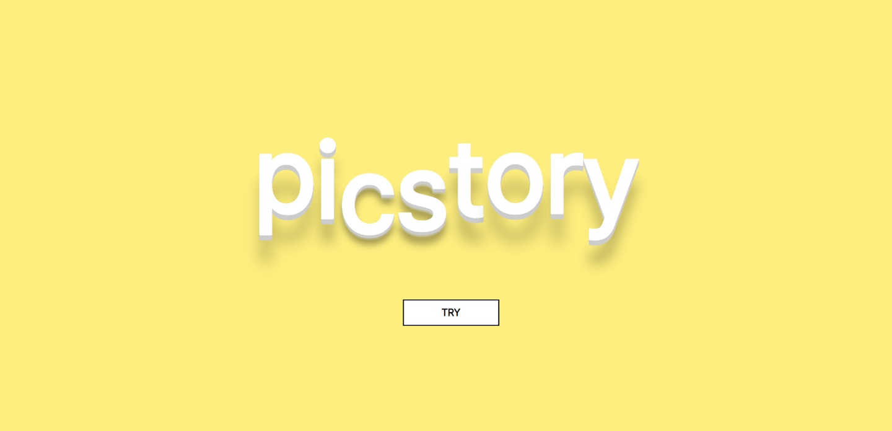

# ​🧡픽스토리(Picstory)🧡




- SSAFY 8th PJT **Team D103**​ 🌞
- 프로젝트 기간 : `2023.02.20` ~ `2023.04.07`
- 구성원 : 김소희, 권아진, 백소원, 조재완, 서재건, 최성민  
- 팀 노션 : <a href="" target="_blank">👉 픽스토리(Picstory) Notion 👈</a>

<br>

# 📄 ​Contents


[:one: Introduction](#​one-introduction)<br>
[:two:​ Tech Stack](#two​-tech-stack)<br>
[:three:​ System Architecture](#three-system-architecture)<br>
[:four:​ ERD](#four-erd)<br>
[:five:​ WIKI](#five-wiki)<br>
[:six:​ Contributor](#six-contributor)<br>


<br>

## ​:one: Introduction
> 나만의 사진 한 장으로 만들어지는 이야기를 들어보는 서비스
> 
> 내가 만든 글로 재밌게 영어공부하기

기능 영상 소개

~

<br>

## ​:two:​ Tech Stack
| Tech         | Stack                                  |
| ------------ | -------------------------------------- |
| **Language** | Python, JavaScript                       |
| **Backend**  | Django, JWT |
| **Frontend** | React.js, Vuetify, Vuex                  |
| **Database** | MariaDB, Redis                                |
| **Server**   | AWS EC2, NginX                         |
| **DevOps**   | Git, Docker, Jenkins                            |

<details>
<summary>Backend Tech 상세 보기</summary>
<div markdown="1">

  <br>

  - Python: 3.9.13 <br>
  - Django: 3.2.13 <br>
  - MariaDB: 10.3.23 <br>
  - Redis: 5.0.7 <br>
  - Docker: 23.0.1 <br>
  - Jenkins: 2.387.1 <br>
  - nginx: 1.18.0 <br>

</div>
</details>

<details>
<summary>Frontend Tech 상세 보기</summary>
<div markdown="1">

    - react
    - 아래 수정
    - vue/cli
    - vue-router
    - vuex
    - vuex-persistedstate
    - vuetify
    - axios

</div>
</details>

<br>


## :three:​ System Architecture


<br>


## :four:​ ERD


<br>


## :five:​ WIKI
```
👉 Team Rules(Git, Coding Convention) 및 구현 
```
- [HOME]()
  - [1. Team Rules]()
  - [2. Android Coding Convention]()
  - [3. Server Coding Convention]()
  - [4. Android 구현 내용]()
  - [5. Server 구현 내용]()

<br>


## :six:​ Contributor

```
👉 팀원 소개
```

<table class="tg">
<tbody>
    <tr>
        <td>김소희</td>
        <td><a href="https://github.com/GIT-ID">@GIT-ID</a></td>
    </tr>
    <tr>
        <td>권아진</td>
        <td><a href="https://github.com/GIT-ID">@GIT-ID</a></td>
    </tr>
    <tr>
        <td>백소원</td>
        <td><a href="https://github.com/GIT-ID">@GIT-ID</a></td>
    </tr>
    <tr>
        <td>조재완</td>
        <td><a href="https://github.com/GIT-ID">@GIT-ID</a></td>
    </tr>
    <tr>
        <td>서재건</td>
        <td><a href="https://github.com/RUNGOAT">@RUNGOAT</a></td>
    </tr>
    <tr>
        <td>최성민</td>
        <td><a href="https://github.com/GIT-ID">@GIT-ID</a></td>
    </tr>
</tbody>
</table>


