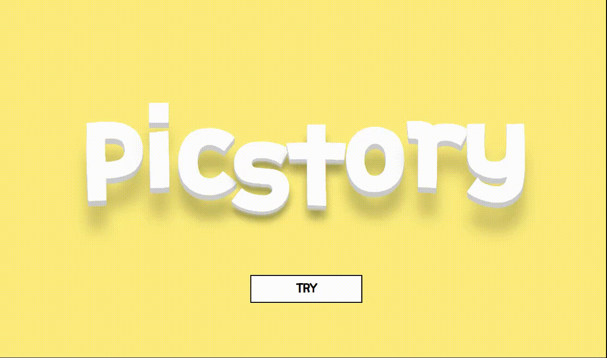
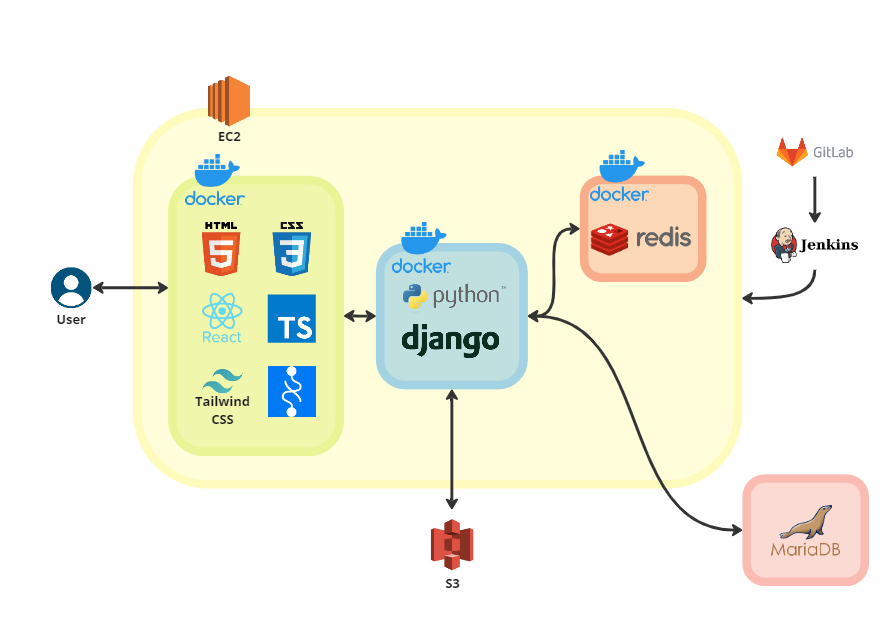
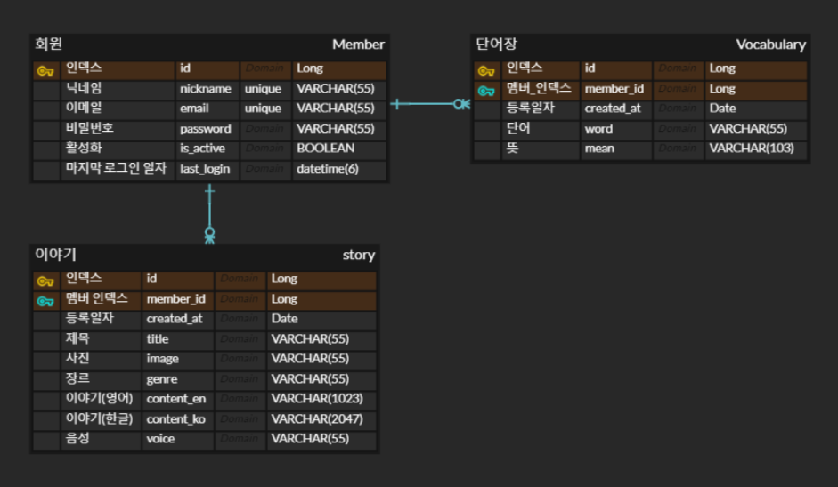

# ​🧡픽스토리(Picstory)🧡




- SSAFY 8th PJT **Team D103**​ 🌞
- 프로젝트 기간 : `2023.02.20` ~ `2023.04.07`
- 구성원 : 김소희, 권아진, 백소원, 조재완, 서재건, 최성민  
- 팀 노션 : <a href="" target="_blank">👉 픽스토리(Picstory) Notion 👈</a>

<br>

# 📌 ​Contents

[:one: Introduction](#one-introduction)<br>
[:two:​ Tech Stack](#two-tech-stack)<br>
[:three:​ System Architecture](#three-system-architecture)<br>
[:four:​ ERD](#four-erd)<br>
[:five:​ Package Structure](#five-package-structure)<br>
[:six:​ API Document](#six-api-document)<br>
[:seven:​ Contributor](#seven-contributor)<br>


<br>

## ​:one: Introduction
> 나만의 사진 한 장으로 만들어지는 이야기를 들어보는 서비스
> 
> 내가 만든 글로 재밌게 영어공부하기

### 💻 기능 영상 소개
~


<br>

## ​:two:​ Tech Stack
| Tech         | Stack                                  |
| ------------ | -------------------------------------- |
| **Language** | Python, TypeScript                       |
| **Back-end**  | Django, JWT |
| **Front-end** | React.js, tailwind, Recoil                  |
| **Database** | MariaDB, Redis, S3                                |
| **Server**   | AWS EC2, NginX                         |
| **DevOps**   | Git, Docker, Jenkins                            |

<details>
<summary>Back-end Tech 상세 보기</summary>
<div markdown="1">

  <br>

```
- Python: 3.9.13
- Django: 3.2.13
- MariaDB: 10.3.23
- Redis: 5.0.7
- Docker: 23.0.1
- Jenkins: 2.387.1
- nginx: 1.18.0
```
</div>
</details>

<details>
<summary>Front-end Tech 상세 보기</summary>
<div markdown="1">

  <br>

```
- node.js: 18.14.2
- npm: 9.6.0
- react: 18.2.0
- Typescript: 4.9.5
- recoil: 0.7.7
- tailwind: 3.2.7
```
</div>
</details>

<br>


## :three:​ System Architecture




<br>


## :four:​ ERD




<br>


## :five: Package Structure

<details>
<summary>Front-end Package Structure</summary>
<div markdown="1">


</div>
</details>

<details>
<summary>Back-end Package Structure</summary>
<div markdown="1">

```
📂BACKEND
│  .env
│  .gitignore
│  Dockerfile
│  manage.py
│  README.md
│  requirements.txt
│      
├─📂accounts
│  │  admin.py
│  │  apps.py
│  │  models.py
│  │  serializers.py
│  │  tests.py
│  │  urls.py
│  │  views.py
│  │  __init__.py
│  │  
│  └─📂migrations
│       │  0001_initial.py
│       └─__init__.py
│          
├─📂config
│  │  asgi.py
│  │  settings.py
│  │  urls.py
│  │  wsgi.py
│  └─__init__.py
│          
├─📂media
│  └─📂audio
│          
├─📂middleware
│  └─custom_middleware.py
│          
├─📂story
│  │  admin.py
│  │  apps.py
│  │  models.py
│  │  serializers.py
│  │  tests.py
│  │  tts_test.py
│  │  urls.py
│  │  views.py
│  │  __init__.py
│  │  
│  └─📂migrations
│       │  0001_initial.py
│       └─__init__.py
│          
└─📂vocabulary
    │  admin.py
    │  apps.py
    │  models.py
    │  serializers.py
    │  tests.py
    │  urls.py
    │  views.py
    │  __init__.py
    │  
    └─📂migrations
         │  0001_initial.py
         └─__init__.py
```

</div>
</details>

<br>

## :six: API Document

:point_right: [API Document](https://documenter.getpostman.com/view/26196793/2s93RZKpFR)

<br>

## :seven:​ Contributor

```
👉 팀원 소개
```

<table class="tg">
<tbody>
    <tr>
        <td>김소희</td>
        <td><a href="https://github.com/ssooh-i">@ssooh-i</a></td>
    </tr>
    <tr>
        <td>권아진</td>
        <td><a href="https://github.com/chocolajin">@chocolajin</a></td>
    </tr>
    <tr>
        <td>백소원</td>
        <td><a href="https://github.com/Wish-baek">@Wish-baek</a></td>
    </tr>
    <tr>
        <td>조재완</td>
        <td><a href="https://github.com/johjaewan">@johjaewan</a></td>
    </tr>
    <tr>
        <td>서재건</td>
        <td><a href="https://github.com/RUNGOAT">@RUNGOAT</a></td>
    </tr>
    <tr>
        <td>최성민</td>
        <td><a href="https://github.com/et2468">@et2468</a></td>
    </tr>
</tbody>
</table>


