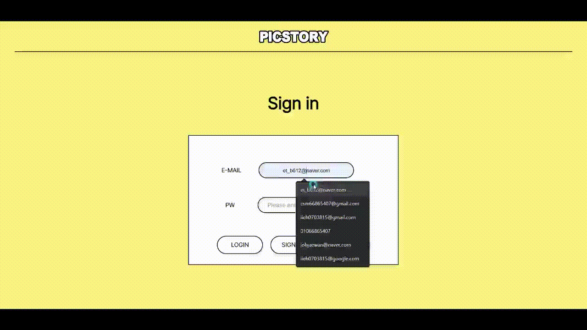
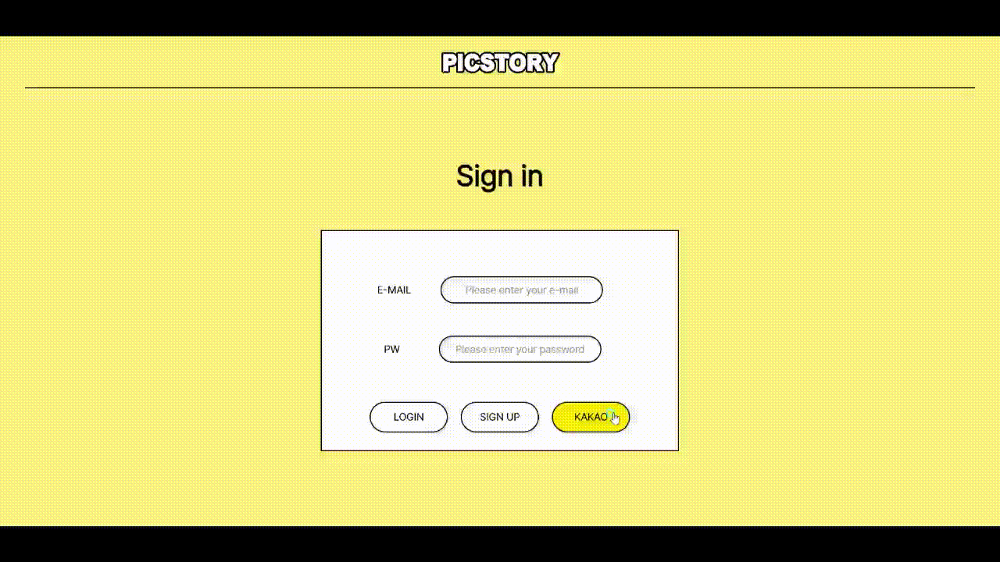
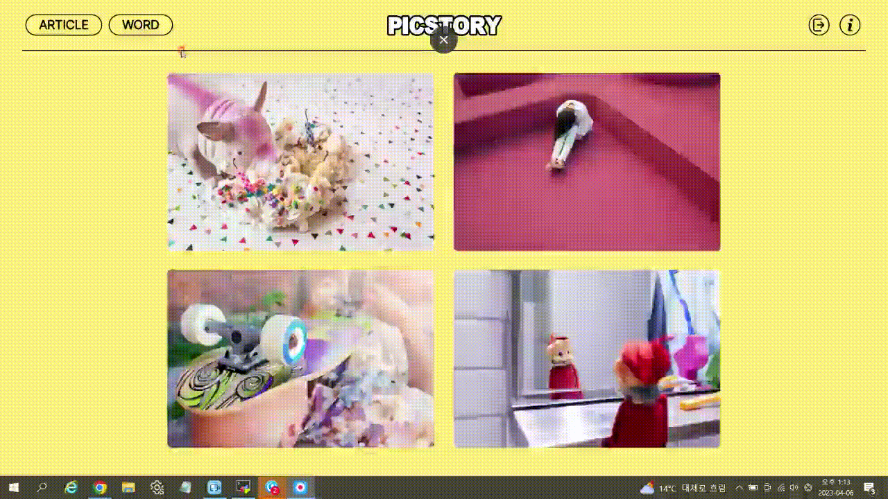
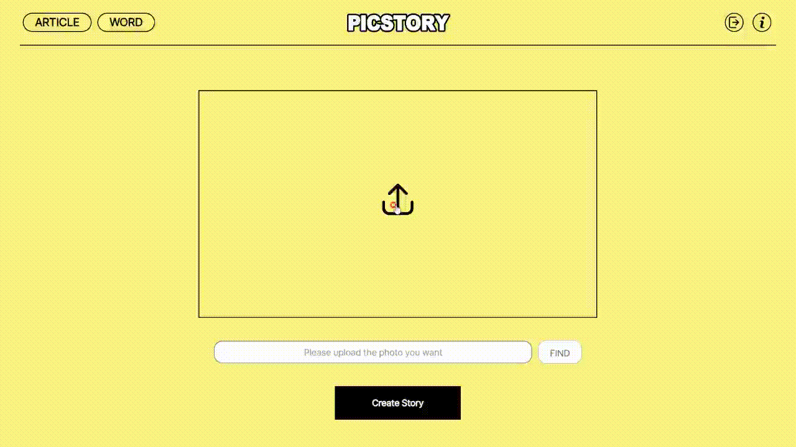
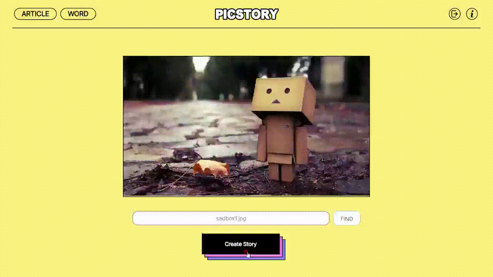
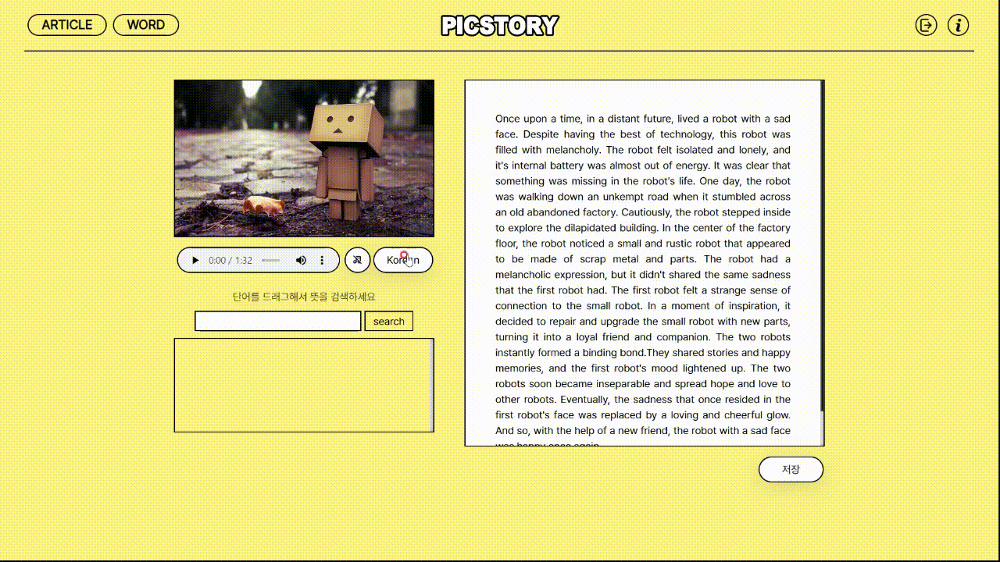
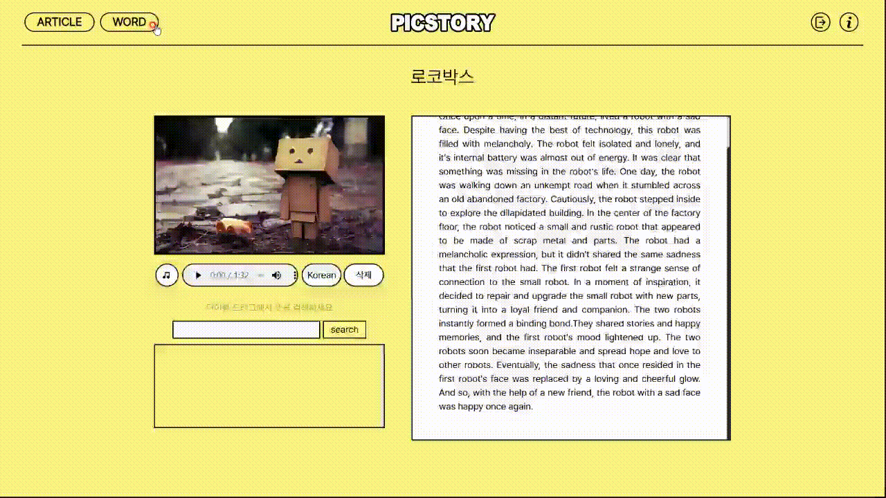

# 픽스토리(Picstory)

## 로그인
> 일반적인 회원가입하고 로그인

## 카카오 로그인
> 카카오톡을 통한 로그인

## 장르 선택
> 재미, 슬픔, 로맨스, 공포 4가지 장르중 하나 선택

## 이미지 삽입
> 이야기로 만들고 싶은 이미지를 선택

## 로딩 화면 / 단어 퀴즈
> 로딩 되는 동안 단어 퀴즈를 할 수 있습니다.

## 이야기 페이지
> 만들어진 이야기를 보고 들을 수 있고 저장할 수 있습니다.

## 단어 검색
> 이야기내의 단어를 검색할 수 있습니다.

## 단어장
> 내가 저장한 단어들을 볼 수 있습니다.

